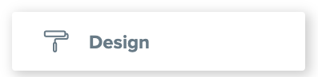

# What You Need to Configure

## Quote Branding

Your System Administrator can make some modifications to the branding of your quotes, including:

* [ ] Configuration of the logo size and position on different pages.
* [ ] Selection of the primary colour of bands within the Quote Rates Pages.
* [ ] Entering the Company Name to appear on the Quote and Costing Calculator.



Click on the Tabs to find the appropriate step-by-step instructions for each action.



#### Click on the "Design" Icon in the Sidebar Menu.

It looks like this:

#### Select the "Quote Logo" Entry.

#### Click the "Edit" Button.

#### Paste the Base 64 encoding of your image in the Text Field.

#### Click Submit.



























## Costing Calculator Branding

Your System Administrator can also modify branding of your Costing Calculator Colours. The Costing Calculator allows for four different colours to be set up.


Both the Company Name and Image settings for your Quote Branding will also apply to the Costing Calculators.




Click on the Tabs to find the appropriate step-by-step instructions for each action.







## Mailjet Setup and Email Branding

To email Quotes and Costing Calculators from within the system, the system requires the following Mailjet Account Details:

* [ ] Mailjet Public Key
* [ ] Mailjet Private Key
* [ ] Quote Email Template ID



Click on the Tabs to find the appropriate step-by-step instructions for each action















## Terms and Conditions

The last page of Quotes and Costing Calculators usually contains the applicable terms and conditions. Users can make quote-specific changes to these terms, but the default terms and conditions are also set up in a similar way to the variables above. Some companies also like to adjust the location of the terms to a lower location on the page, so this location is configurable.



Click on the Tabs to find the appropriate step-by-step instructions for each action











