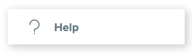

# Where to Find More Information

## User Help Files

Your users can find instructions about the features of NavLab on the Help page within the application. Just click on the "Help" item in the Sidebar Menu.


You will also find a summary of the latest feature releases under the "What's New" heading of the Help files.


## Contacting Support

## Finding Release Notes

  

## 

