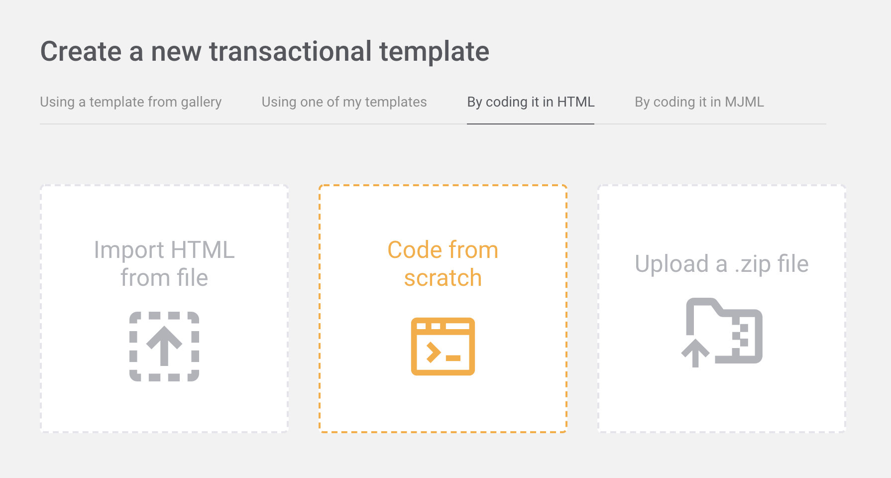

# Customise Quote Emails

Note: You will need to work with your IT department on this. Please start early as the whole process might take a few days.

## 1. Set up Mailjet

### 1.1 Register Mailjet account

Go to [https://app.mailjet.com/signup](https://app.mailjet.com/signup) and create a Mailjet account.

### 1.2 Add sender domain and addresses

This is what goes into the "from" field of your emails. You can either

* add your company domain which allows all your staff to send emails through Mailjet [https://app.mailjet.com/account/sender/domain/add](https://app.mailjet.com/account/sender/domain/add), or
* add individual emails which only allows emails you have added to send emails through Mailjet [https://app.mailjet.com/account/sender/add](https://app.mailjet.com/account/sender/add)

### 1.3 Set up domain authentication

Since emails will be going out from a Mailjet server instead of your company server, you need to prove that they are genuine. Otherwise they will be regarded as spam.

Please ask your IT department to follow this guide \([https://app.mailjet.com/docs/spf-dkim-guide](https://app.mailjet.com/docs/spf-dkim-guide)\) and set up SPF and DKIM for your domain. Please note that it might take up to 24 hours for the configuration to be recognised by Mailjet.

## 2 Save API keys

Go to [https://app.mailjet.com/account/setup](https://app.mailjet.com/account/setup). You will see a page like this.


Copy the USERNAME \(API KEY\). Open MagiQ Design page and save what you just copied in Mailjet Public Key.


Copy the PASSWORD \(SECRET KEY\) and save it in Mailjet Private Key.


## 3 Create email template

We need to create an email template for quotes and cost calculations.

1. Go to [https://app.mailjet.com/templates/start/transactional](https://app.mailjet.com/templates/start/transactional) and click on "By coding it in HTML".



2. Click on "Code from scratch" and give the template a name.


3. Click on "Edit subject" to configure the default subject and sender name. You can enter anything as they will be replaced by the Quote Builder/Costing Calculator.


4. In the editor you can use HTML to build your email layout to your liking. But you need to insert this code block `<pre>{{var:body:""}}</pre>` which is a placeholder for email content coming from the Quote Builder/Costing Calculator.


5. You may also use the following variables in the HTML:

| Variable Name | Meaning |
| :--- | :--- |
| salesRepName | Sales Rep's name |
| salesRepTitle | Sales Rep's title |
| salesRepMobile | Sales Rep's mobile |
| salesRepTel | Sales Rep's telephone |

Here is an example:

```markup
<html>
  <body>
    <pre style='font-family:"Calibri Light",sans-serif'>{{var:body:""}}</pre>
    
    <p>
      <span style='font-size:13.0pt;font-family:"Calibri Light",sans-serif;color:#0075bb'>{{var:salesRepName:""}}</span>
    </p>
    <p>
      <i>
        <span style='font-family:"Calibri Light",sans-serif;color:#002060'>{{var:salesRepTitle:""}}</span>
      </i>
    </p>
    
    <p style="margin-top:18.0pt;line-height:115%">
      <span style='font-family:"Calibri Light",sans-serif;color:#002060'>M: {{var:salesRepMobile:""}}</span>
    </p>
    
    
    <p style="line-height:115%">
      <span style='font-family:"Calibri Light",sans-serif;color:#002060'>T: {{var:salesRepTel:""}}</span>
    </p>
    
  </body>
</html>
```


6. Click on the Preview & Test button in the top-right corner and then click on Preview email.


7. Click on Expert Mode and paste the following text into the editor. Then click on Update Variables. You will see the preview on the right-hand side. You can also change the text in Expert Mode or Normal Mode to try different content.

```javascript
{
  "Data": {},
  "Variables": {
    "salesRepTel": "",
    "salesRepMobile": "0412345678",
    "salesRepTitle": "Sales Manager",
    "salesRepName": "John Smith",
    "body": "Dear Customer,\n\nPlease find attached your current rates for:\n\n* Shanghai to Sydney - FCL\n\nDon’t hesitate to ask should you have any questions.\n\nKind regards,"
  }
}
```


8. Once you are finished editing the template, click on Save & Publish button in the top-right corner.


9. You should see a screen like this. Click on Copy Template ID.


10. Go to MagiQ and open the Design page. Save the Template ID you just copied in Quote Email Template ID.


